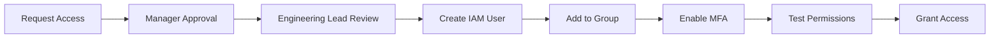

# Deployment User Management for InformUp Projects

**Purpose**: Guide for adding and managing users who can deploy InformUp applications to AWS.

**Last Updated**: 2025-10-18
**Applies To**: All InformUp projects using AWS deployment

---

## Table of Contents

1. [Overview](#overview)
2. [User Roles and Permissions](#user-roles-and-permissions)
3. [Adding a New Deployment User](#adding-a-new-deployment-user)
4. [Removing User Access](#removing-user-access)
5. [Troubleshooting](#troubleshooting)

---

## Overview

InformUp uses AWS IAM (Identity and Access Management) to control who can deploy applications to production. This ensures:

- **Security**: Only authorized personnel can deploy
- **Audit**: All deployments are tracked
- **Accountability**: Each deployment is tied to a specific user

### Who Needs Deployment Access?

- **Core Engineering Team**: Full deployment permissions
- **Trusted Contributors**: May have read-only or limited deployment access
- **CI/CD Systems**: GitHub Actions service accounts

---

## User Roles and Permissions

### 1. Core Deployer (Full Access)

**IAM Group**: `InformUp-Ghost-Deployers`

**Permissions**:
- ✅ Deploy applications
- ✅ Manage EC2 instances
- ✅ Push/pull Docker images from ECR
- ✅ Access S3 backups
- ✅ View CloudWatch logs
- ✅ Read secrets from Secrets Manager

**Granted To**:
- Engineering leads
- Senior engineers
- DevOps team members

### 2. Read-Only Viewer

**IAM Group**: `InformUp-Viewers`

**Permissions**:
- ✅ View EC2 instances
- ✅ View CloudWatch logs
- ✅ View deployment status
- ❌ Cannot deploy or modify infrastructure

**Granted To**:
- Junior engineers
- Product managers
- QA team members

### 3. CI/CD Automation (GitHub Actions)

**⭐ Uses OIDC** (OpenID Connect) instead of permanent credentials

**IAM Role**: `GitHubActionsGhostDeployer`

**Permissions**:
- ✅ Automated deployments only
- ✅ Push Docker images to ECR
- ✅ Update EC2 instances
- ✅ Temporary credentials (automatically rotated)
- ❌ No console access
- ❌ No permanent access keys

**Security Benefits**:
- No static credentials to manage or rotate
- Credentials expire automatically after each workflow run
- Better audit trail through AWS CloudTrail

---

## Adding a New Deployment User

### Prerequisites

Before adding a user, ensure:
- [ ] User is an employee or approved contributor
- [ ] User has completed security training
- [ ] User's manager has approved access
- [ ] User has a valid @informup.org email address

### Process Overview



---

### Step 1: Request Access

**User** creates a GitHub issue in the `.github` repository:

**Template**:

```markdown
**Title**: [Access Request] Deployment Access for [Name]

**User Information**:
- Name: Jane Doe
- Email: jane.doe@informup.org
- Role: Senior Engineer
- GitHub Username: @janedoe
- Requested Access Level: Core Deployer

**Justification**:
I need deployment access to manage production deployments for the Ghost CMS project.

**Manager Approval**:
@manager-username - Please approve

**Projects Requiring Access**:
- [ ] InformUp Ghost (informup.org)
- [ ] Reporter Dashboard
- [ ] Other: ___________
```

---

### Step 2: Manager Approval

**Manager** comments on the issue:

```markdown
✅ Approved

Justification: Jane is leading the Ghost CMS migration and needs deployment access.
```

---

### Step 3: Engineering Lead Review

**Engineering Lead** verifies:
- [ ] User is authorized
- [ ] Appropriate access level requested
- [ ] No security concerns

Comments with approval:

```markdown
✅ Engineering Lead Approval

Access level: Core Deployer
Group: InformUp-Ghost-Deployers

Proceeding with IAM setup.
```

---

### Step 4: Create IAM User (Admin Task)

**Admin** performs the following steps:

#### Using AWS Console:

1. Log in to AWS Console with admin credentials
2. Navigate to **IAM** → **Users** → **Create user**
3. Fill in details:
   - Username: `jane.doe`
   - Access type: ✅ **AWS Management Console access**
   - Console password: Auto-generated
   - ✅ **Require password reset on first sign-in**
4. Click **Next: Permissions**
5. Select **Add user to group**
6. Select group: `InformUp-Ghost-Deployers`
7. Click **Next: Tags**
8. Add tags:
   ```
   Email: jane.doe@informup.org
   Role: Senior-Engineer
   Project: InformUp-Ghost
   DateAdded: 2025-10-18
   RequestedBy: manager-name
   ```
9. Click **Next: Review**
10. Review and click **Create user**
11. **Save credentials securely** (copy to password manager)

#### Using AWS CLI:

```bash
# Set variables
USER_EMAIL="jane.doe@informup.org"
USERNAME="jane.doe"
GROUP_NAME="InformUp-Ghost-Deployers"
TEMP_PASSWORD=$(openssl rand -base64 12)

# Create user
aws iam create-user \
  --user-name $USERNAME \
  --tags \
    Key=Email,Value=$USER_EMAIL \
    Key=Role,Value=Senior-Engineer \
    Key=Project,Value=InformUp-Ghost \
    Key=DateAdded,Value=$(date +%Y-%m-%d) \
    Key=RequestedBy,Value=manager-name

# Create login profile
aws iam create-login-profile \
  --user-name $USERNAME \
  --password "$TEMP_PASSWORD" \
  --password-reset-required

# Add to deployment group
aws iam add-user-to-group \
  --user-name $USERNAME \
  --group-name $GROUP_NAME

# Print credentials (send securely to user)
echo "Username: $USERNAME"
echo "Temporary Password: $TEMP_PASSWORD"
echo "AWS Console: https://ACCOUNT_ID.signin.aws.amazon.com/console"
```

---

### Step 5: Send Credentials to User

**Admin** sends credentials via **secure channel** (never via email or Slack):

**Recommended Methods**:
1. **1Password** - Share via secure vault
2. **AWS Secrets Manager** - User retrieves with existing access
3. **In-person** - Hand over printed credentials

**Message Template**:

```
Hi Jane,

Your AWS deployment access has been set up:

Username: jane.doe
Temporary Password: [See 1Password]
AWS Console: https://ACCOUNT_ID.signin.aws.amazon.com/console

Next Steps:
1. Log in to AWS Console
2. Change your temporary password
3. Enable MFA (REQUIRED - see guide below)
4. Test your permissions
5. Configure AWS CLI (optional)

MFA Setup Guide:
https://github.com/INFORMUP/.github/blob/main/docs/DeploymentUserManagement.md#step-6-enable-mfa

Please confirm setup complete by commenting on the access request issue.
```

---

### Step 6: Enable MFA (User Task)

**⚠️ REQUIRED - User must enable MFA within 24 hours**

**User** performs:

1. Log in to AWS Console
2. Navigate to **IAM** → **Users** → **[Your Username]**
3. Click **Security credentials** tab
4. Under **Multi-factor authentication (MFA)**, click **Assign MFA device**
5. Choose **Virtual MFA device**
6. Use an authenticator app:
   - **Recommended**: Authy, Google Authenticator, Microsoft Authenticator
   - **Not recommended**: SMS (less secure)
7. Scan QR code with authenticator app
8. Enter two consecutive MFA codes
9. Click **Assign MFA**

**Verify MFA**:
- Log out and log back in
- Should prompt for MFA code after password

---

### Step 7: Configure AWS CLI (Optional)

If user needs CLI access:

```bash
# Install AWS CLI (if not already installed)
# macOS: brew install awscli
# Linux: sudo apt install awscli

# Configure credentials
aws configure

# Enter when prompted:
# AWS Access Key ID: [Create in AWS Console → IAM → Users → Security credentials → Create access key]
# AWS Secret Access Key: [From previous step]
# Default region name: us-east-1
# Default output format: json

# Test access
aws sts get-caller-identity

# Expected output:
# {
#     "UserId": "AIDAEXAMPLE",
#     "Account": "123456789012",
#     "Arn": "arn:aws:iam::123456789012:user/jane.doe"
# }
```

---

### Step 8: Test Permissions

**User** runs permission tests:

```bash
# Clone the Ghost repository
git clone https://github.com/INFORMUP/informup-ghost.git
cd informup-ghost

# Run permission test script
./scripts/production/test-aws-permissions.sh
```

**Expected Output**:
```
Testing AWS Permissions for InformUp Ghost Deployment
======================================================
ECR Repository Access: ✓ OK
S3 Backup Bucket Access: ✓ OK
EC2 Describe Access: ✓ OK
CloudWatch Logs Access: ✓ OK
Secrets Manager Access: ✓ OK

Permission test complete!
```

---

### Step 9: Close Access Request

**User** comments on GitHub issue:

```markdown
✅ Setup Complete

- [x] Password changed
- [x] MFA enabled
- [x] AWS CLI configured
- [x] Permissions tested

Ready to deploy!
```

**Admin** closes the issue and updates documentation:

```markdown
✅ Access Granted

User: jane.doe
Group: InformUp-Ghost-Deployers
Date: 2025-10-18
MFA: Enabled
Permissions: Verified

Closing issue. Welcome to the deployment team, @janedoe!
```

---

## Removing User Access

### When to Remove Access

- User leaves InformUp
- User changes roles and no longer needs deployment access
- Security incident involving user credentials
- User request

### Offboarding Process

#### Step 1: Disable Access Immediately

```bash
# Disable console access
aws iam delete-login-profile --user-name jane.doe

# Delete access keys
aws iam list-access-keys --user-name jane.doe
aws iam delete-access-key --user-name jane.doe --access-key-id AKIAEXAMPLEKEY

# Remove from groups
aws iam remove-user-from-group \
  --user-name jane.doe \
  --group-name InformUp-Ghost-Deployers
```

#### Step 2: Audit Recent Activity

```bash
# Check recent API calls (CloudTrail)
aws cloudtrail lookup-events \
  --lookup-attributes AttributeKey=Username,AttributeValue=jane.doe \
  --start-time $(date -u -d '7 days ago' '+%Y-%m-%dT%H:%M:%S') \
  --max-results 50
```

#### Step 3: Document Removal

Update tracking spreadsheet or create GitHub issue:

```markdown
**Title**: [Access Removal] jane.doe

**Reason**: User departed InformUp

**Actions Taken**:
- [x] Console access disabled
- [x] Access keys deleted
- [x] Removed from deployment groups
- [x] CloudTrail audit completed
- [x] No suspicious activity found

**Date**: 2025-10-18
**Removed By**: admin-username
```

---

## Troubleshooting

### User Can't Log In

**Symptoms**: "Incorrect username or password"

**Solutions**:
1. Verify username is correct (should match email prefix)
2. Check if account is active: `aws iam get-user --user-name jane.doe`
3. Reset password if needed

### MFA Not Working

**Symptoms**: "Invalid MFA code"

**Solutions**:
1. Verify time sync on device (authenticator apps rely on accurate time)
2. Check if using correct MFA device in authenticator app
3. Admin can reset MFA: IAM → Users → [User] → Security credentials → Remove MFA
4. User re-enables MFA following Step 6

### Permission Denied Errors

**Symptoms**: "User: arn:aws:iam::123456789012:user/jane.doe is not authorized to perform..."

**Solutions**:
1. Verify user is in correct group:
   ```bash
   aws iam list-groups-for-user --user-name jane.doe
   ```
2. Check group has correct policies:
   ```bash
   aws iam list-attached-group-policies --group-name InformUp-Ghost-Deployers
   ```
3. Review CloudTrail for specific error details

### Access Keys Not Working

**Symptoms**: "The security token included in the request is invalid"

**Solutions**:
1. Verify access key is active:
   ```bash
   aws iam list-access-keys --user-name jane.doe
   ```
2. Ensure `~/.aws/credentials` file has correct keys
3. Try creating new access keys (delete old ones first)

---

## User Access Audit

### Monthly Audit Checklist

Admins should review access monthly:

- [ ] List all users in deployment groups
- [ ] Verify all users still require access
- [ ] Check for inactive users (no activity in 30+ days)
- [ ] Confirm all users have MFA enabled
- [ ] Review access key age (rotate if > 90 days)
- [ ] Check for unused access keys
- [ ] Review CloudTrail for suspicious activity

**Audit Script**:

```bash
#!/bin/bash
# Monthly deployment access audit

echo "InformUp Deployment Access Audit - $(date)"
echo "=========================================="

echo -e "\nUsers in InformUp-Ghost-Deployers group:"
aws iam get-group --group-name InformUp-Ghost-Deployers --query 'Users[*].[UserName,CreateDate]' --output table

echo -e "\nMFA Status:"
for user in $(aws iam get-group --group-name InformUp-Ghost-Deployers --query 'Users[*].UserName' --output text); do
  MFA=$(aws iam list-mfa-devices --user-name $user --query 'MFADevices[*].EnableDate' --output text)
  if [ -z "$MFA" ]; then
    echo "❌ $user - MFA NOT ENABLED"
  else
    echo "✅ $user - MFA enabled since $MFA"
  fi
done

echo -e "\nAccess Key Age:"
for user in $(aws iam get-group --group-name InformUp-Ghost-Deployers --query 'Users[*].UserName' --output text); do
  aws iam list-access-keys --user-name $user --query 'AccessKeyMetadata[*].[UserName,AccessKeyId,CreateDate,Status]' --output table
done
```

---

## Quick Reference

### IAM Group Names

- **InformUp-Ghost-Deployers**: Full deployment access
- **InformUp-Viewers**: Read-only access

### AWS Console URL

```
https://ACCOUNT_ID.signin.aws.amazon.com/console
```

### Common AWS CLI Commands

```bash
# Check your identity
aws sts get-caller-identity

# List your groups
aws iam list-groups-for-user --user-name $(aws sts get-caller-identity --query 'Arn' --output text | cut -d'/' -f2)

# Test ECR access
aws ecr describe-repositories --repository-names informup-ghost

# Test S3 access
aws s3 ls s3://informup-ghost-backups/

# View your access keys
aws iam list-access-keys --user-name $(aws sts get-caller-identity --query 'Arn' --output text | cut -d'/' -f2)
```

---

## Support

**For Access Issues**:
- Slack: #engineering channel
- Email: engineering@informup.org
- GitHub Issue: [Create in .github repository]

**Emergency Access Removal**:
- Contact: security@informup.org
- Phone: [On-call engineering lead]

---

## Related Documentation

- [AWS IAM Setup Guide](../../informup_site/docs/aws-iam-setup.md)
- [AWS Infrastructure Setup](../../informup_site/docs/aws-infrastructure-setup.md)
- [Engineering Overview](./EngineeringOverview.md)
- [Security Best Practices](https://docs.aws.amazon.com/IAM/latest/UserGuide/best-practices.html)
